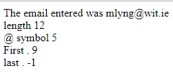

# String Exercises

- Create a folder called Week03.
- Open the Week03 folder and create another folder called lab01.
- Open the lab01 folder.
- Create web pages that include JavaScript code for each of the following and store them in the lab01 folder:

 1  **stringexercise1.html**: Prompt the user for their name. Using **.length** and **.charAt()**:

     a Return the length of the string entered;
     b the first character;
     c and the last character.
    
 2  **stringexercise2.html**: Prompt the user for an email address. Using **indexOf() and lastIndexOf()**:

     a Output the string entered;
     b the length of the string; 
     c the position of the @; 
     d the position of the first . (full stop) after the @; 
     e and the position of the last . (full stop)  before the @.
     
 

 3  **stringexercise3.html**: Given a student record such as: Jane Doe: 45: 60: 80 stored in a string. 

 ~~~
 var record = "Jane Doe:45:60:80 ";
 ~~~

 The numbers correspond to marks achieved during the semester. Using **split()**, extract each element and calculate the overall mark. 
 The first 2 marks are CA (first mark worth 20%; and the second mark worth 30%). The final mark is the exam paper (worth 50%).

 Output Jane Doe: 67

 4  **stringexercise4.html**: Create a variable *coursecode* and assign a value as follows:

 ~~~
 var coursecode = "wd151";
 ~~~

 Using **substring()**, extract and output the first 2 characters into 1 variable; and extract and output the remainder of the string into another variable. 
 Verify that the second variable is numeric (use isNaN). 

