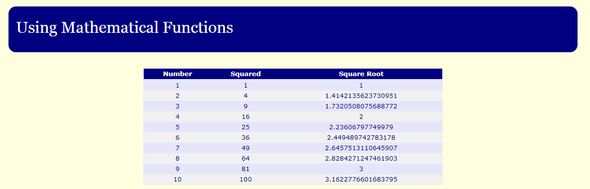
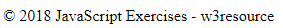

# String Exercises

- Download, extract and open the [lab02](archives/lab02.zip) folder in Week03.
- Open the lab02 folder. Inside this folder is a folder called squares.
- Open the square folder.

  1  **maths.html**: You are given the template for a web page with a table in the sub folder. You are to add JavaScript code that 
   will display the numbers from 1 to 10; the corresponding squared value; and the corresponding square root. 
   For the *squared* and *square root* values use **Mathematical Functions**.
         
  

- Return to the lab02 folder again.
- Create web pages that include JavaScript code for each of the following and store them in the lab02 folder:

  2  **random.html**: Write code that will generate and display a random number between 1 and 20. 

  3  **date.html**: Write JavaScript code that will output the following to the screen using the Date Functions:

  

