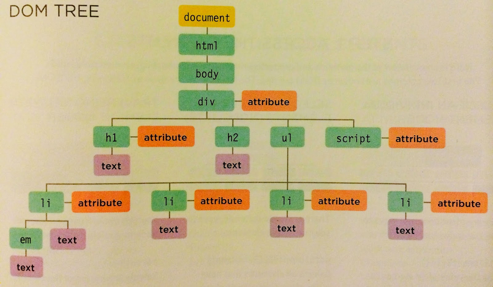

# DOM Tree

As a browser loads a web page, it creates a model of that page. The model is called a **DOM** tree, and it is stored in the browsers' memory. 

**Example**
~~~
<html>
  <body>
    

      <h1 id="header">List King</h1>
      <h2>Buy groceries</h2>
      <ul>
        <li id="one" class="hot"><em>fresh</em> figs</li>
        <li id="two" class="hot">pine nuts</li>
        <li id="three" class="hot">honey</li>
        <li id="four">balsamic vinegar</li>
      </ul>
      
    

  </body>
</html>
~~~

The following image is a model of the above web page.

