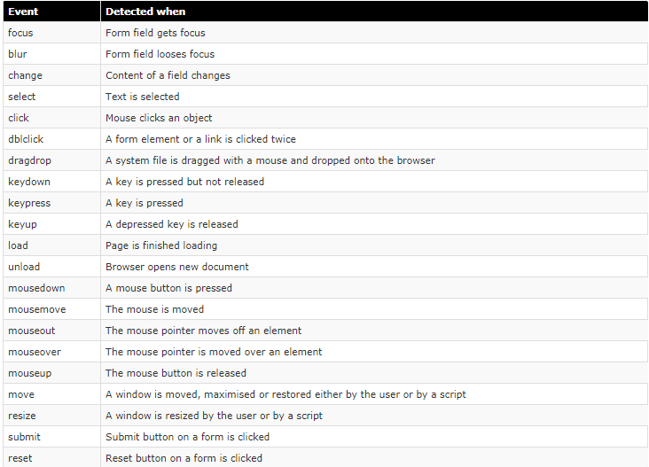

# Events

When you browse the web, your browser registers different types of events. It's the bowsers way of saying "Hey, this just happened". Your script can then respond
to these events.

An example would be the **mouseover** event, which is detected when the user moves the mouse over an object.   

Another event is the **load** event, which is detected as soon as the page is finished loading.

The following are the most important events recognized by javascript:

## Events Fire or are Raised
When an event has occurred, it is often described as having **fired** or been **raised**.

## Events Trigger Scripts
Events are said to **trigger** a function or script.

