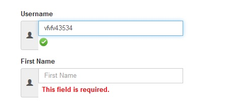

# Event Handling

When the user interacts with the HTML on a web page, there are three steps involved in getting it to trigger some JavaScript code. Together these steps are known as **Event Handling**.

1. Select the *element* node(s) you want the script to respond to.
2. Indicate which *event* on the selected node(s) will trigger the response.
3. State the *code* you want to run when the event occurs.

## Example

 

1. The element that users are interacting with is the text input where they enter their firstname.
2. When users move out of the text input, it loses focus, and the **blur** event fires on this element.
3. When the **blur** event fires on the firstname input, it will trigger a function, which will check whether the text entered is valid or not.
