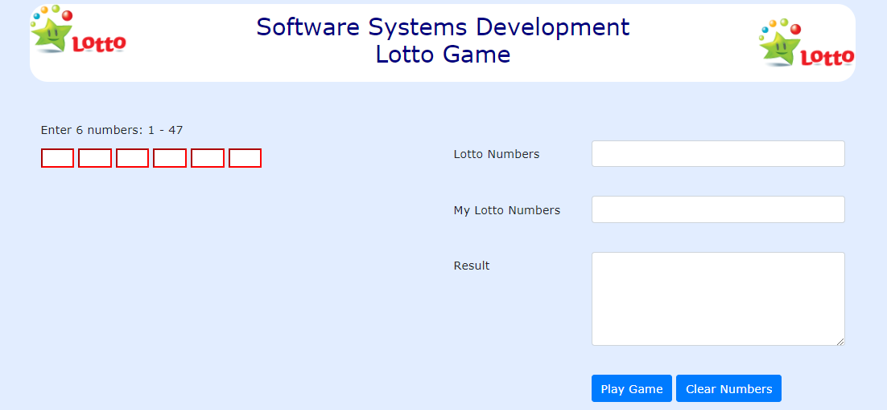

# Objectives

This lab will use JavaScript code to play a simple Lotto game.

Previously in class, we wrote code generating 6 random numbers and saving them to an array (myNumbers). And we wrote code to prompt the user for 
their 6 lotto numbers and also saved them to an array (lottoNumbers). As the numbers are input they are validated. Then we wrote code to compare the arrays. 

Now, we will write code for the <a href="archives/lotto/lotto.html" target = "_blank">lotto</a> game again, this time using forms. 
The screenshot below includes 2 forms (numbers and lotto).

- [Form One](#01)
- [Form Two - Play Game](#02)
- [Form Two - Clear Numbers](#03)

