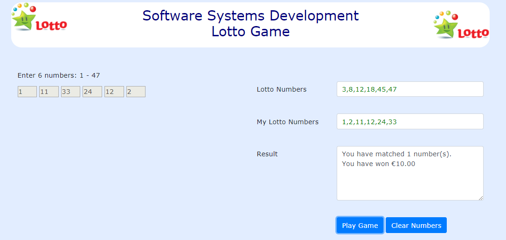

#Form Two - Play Game

The second form (lotto) has 2 text boxes, a textarea, and 2 buttons. 

When the user presses (*clicks*) the Play Game button, the click event will trigger a function call to **newNumbers**. 

~~~
function newNumbers() {
   if (myNumbers.length!=6)  {
     document.getElementById('p1').innerHTML="<b>You must enter 6 valid numbers first</b>";
   }
   else {
     lottoNumbers = [];
     var i=1;
     while ( i<7) {
         newnum=Math.floor(Math.random()*47+1);
         if (checkNums(lottoNumbers, newnum)) {
	        i++;
	        lottoNumbers.push(newnum);
         }
     }
     document.getElementById('lnumbers').value=lottoNumbers.sort(function(a,b){return a - b});
     document.getElementById('mynumbers').value=myNumbers.sort(function(a,b){return a - b});
     compareNumbers();
   }
}

playgame=document.getElementById('play');

playgame.addEventListener('click',newNumbers,false);
~~~

This function includes code to check that the user has entered all their numbers (6 valid numbers) first. If the user has not entered 6 numbers (myNumbers < 6), 
an error message is displayed. 

When 6 valid numbers are in the myNumbers array, a new array (lottoNumbers) is created and populated with 6 valid random numbers between 1 and 47.

Then the numbers from both arrays are output in ascending order to the text boxes in form 2.

Finally, the **compareNumbers** function is called. This function compares the 2 arrays to ascertain if there are any matching numbers. 
Each time a matching number is found a variable (match) is incremented. When the comparison is complete, a string message is composed detailing how many 
(if any) matches were found and how much (if any) money was won. The money component is formatted using a call to the **formatCurrency** function. 
The resulting string is then output to the textarea (results). 

~~~
function compareNumbers() {
   match=0;
   for (i in lottoNumbers) {
     x=myNumbers.indexOf(lottoNumbers[i]);
     if (x>=0) {
       match++;
     }
   }
   string="You have matched "+ match + " number(s)."
   switch (match) {
     case 6:
       win=1000000;
       break;
     case 5:
       win=100000;
       break;
     case 4:
       win=10000;
       break;
     case 3:
       win=1000;
       break;
     case 2:
       win=100;
       break;
     case 1:
       win=10;
       break;
     default:
       win=0;
   }
   string+="\nYou have won " + formatCurrency(win);
   document.getElementById('results').value=string;
}

function formatCurrency(num) {
//Unicode Character 'EURO SIGN' \u20ac*/
   num = num.toString().replace(/\u20ac|\,/g,'');
   if(isNaN(num))
   {
     num = "0";
   }
   sign = (num == (num = Math.abs(num)));
   num = num.toFixed(2);
   elements= num.split(".");
   num = elements[0];
   cents = elements[1];
   for (var i = 0; i < Math.floor((num.length-(1+i))/3); i++)
   {
     num = num.substring(0,num.length-(4*i+3))+','+
     num.substring(num.length-(4*0+3));
   }
   return (((sign)?'':'-') + '\u20ac' + num + '.' + cents)
}
~~~

**Note:**

The error message displayed when the user presses (*clicks*) the Play Game button and there is not enough numbers to proceed, 
is cleared when the user puts focus into any of the input number text boxes.

~~~
for (i=0; i < mylottonumbers.length; i++) {
  ...
  mylottonumbers[i].addEventListener('focus', eraseMsg, false);
} 
~~~
