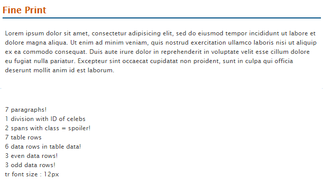
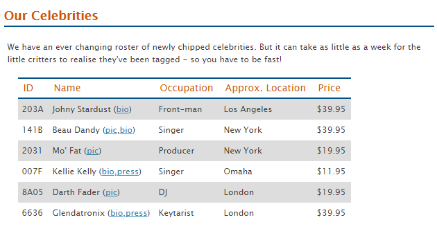
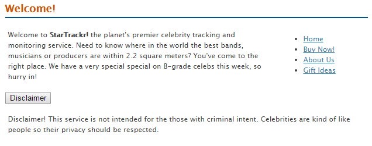

#  Exercise One:

- Create a folder called Week05.
- Download, extract and open the [Lab01](archives/lab01.zip) folder.
- Open the **index.htm** file in your text editor.

### Part 1: Include jQuery library

- Add the following line before the closing body tag. This includes the jQuery library in your code.
```html
<script src="js/jquery-3.1.1.min.js"></script>
```

### Part 2: Add some jQuery 	 

- Now add the following lines after the line from the previous step:

```js
<script>
	 $(document).ready(function(){
      **Code goes here**
   });
</script>
```

- All the following code should go inside the document.ready function.
- Add the following line, inside the document.ready function.

```js
var paras = $('p');
```

This code selects all the paragraphs tags. Now we will output the number of paragraphs in the footer. We are going to append the text to the existing paragraph in the footer.

```js
$('footer p').append(paras.length + ' paragraphs!');
```

Now save the file and open index.htm in your browser. The page should display a message in the footer (7 paragraphs).

### Part 3: Add more jQuery

Add the code to output the following to the footer:

- Number of elements with an id = celebs.
- Number of elements with class = spoiler.
- Number of table rows.
- Number of table rows in the table body.
- Number of even rows in the table body.
- Number of odd rows in the table body.
- The font size of the first table row in the table body.


Now save the file and open index.htm in your browser. The page should display the following in the footer.



### Part 4: Add a background colour to even table rows

Add the code to apply a background colour (#ddd) to the even rows in the table body.



### Part 5: Show the disclaimer paragraph

At the moment the paragraph is hidden, due to this code in the CSS file:

```css
#disclaimer {
     display:none;
}
```


Add code that displays the disclaimer paragraph when the button is clicked.


