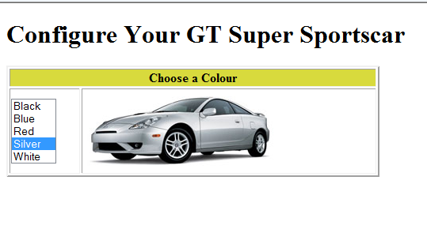

# Exercise Two:

- Download, extract and open the [Lab02](archives/lab02.zip) folder.
- Add code to exercise.htm to change the image displayed depending on the option selected by the user in the select/pull down menu.
- The images to be loaded are:
  - images/black.jpg
  - images/blue.jpg
  - images/red.jpg
  - images/silver.jpg
  - images/white.jpg
- The value selected in the select/pull down menu can be ascertained using the selectedIndex property: $(this).prop('selectedIndex') or using the value of the selected option: $(this).val().

