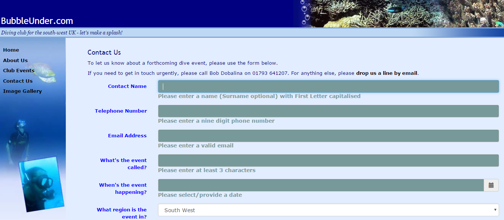
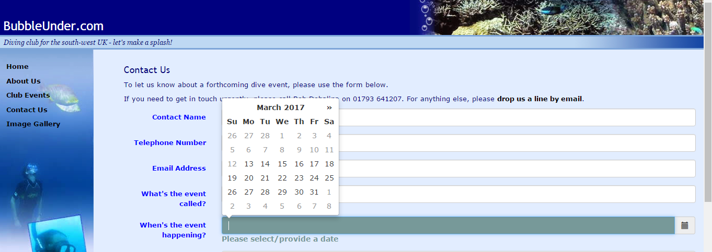

# Exercise Three:

- Download, extract and open the [Lab03](archives/lab03.zip) folder.
- A form (contact.htm) has been created for you within the BubbleUnder website.

**TO DO:**

- Replace the existing date (eventdate) input element with a datepicker that will work across browsers.
  - Include the necessary tags to add the datepicker.
  - Call the datepicker function through jQuery.
  - Modify the datepicker function to change the format to (dd-mm-yyyy);  and the date must be in the future (up to 1 year).
- Add the following attributes to the form (contact.htm):
  - When the form opens the cursor is in the first form element (contactname).
  - The following fields are mandatory contactname, telephone, email, eventname, and eventdate.
  - Add a pattern to the contactname field such that a valid name is entered (Capital followed by lowercase and followed by an optional second name. Add a suitable error message also (title).
  - Add a pattern to the telephone field such that a valid telephone number is entered. Add a suitable error message also.
  - Add a pattern to the email field such that a valid email address is entered. Add a suitable error message also.
  - Add a pattern to the eventname field such that at least 3 characters are entered. Add a suitable error message also.
- Add suitable error messages that will be displayed on the screen, utilising the h5validate plugin.
  - Create the required style rules in the css file (style.css).
  - Call the h5validate function through jQuery.
  - Apply the necessary changes to each of the form elements that require validation.

 
