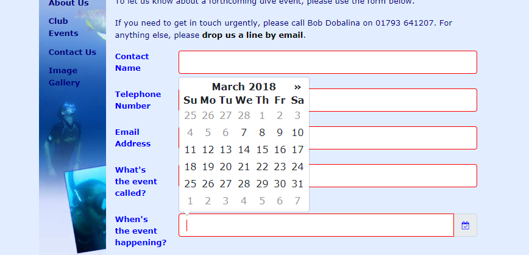

# Exercise Three:

- Download, extract and open the [Lab03](archives/lab03.zip) folder.
- A form (contact.html) has been created for you within the BubbleUnder website.

**TO DO:**

- Replace the existing date (eventdate) input element with a datepicker that will work across browsers.
  - Include the necessary tags to add the datepicker.
  - Call the datepicker function through jQuery.
  - Modify the datepicker function to change the format to (dd-mm-yyyy); and the date must be in the future (up to 1 year).
  

- The following attributes have been included in some of the form elements in the form (contact.html):
  - When the form opens the cursor is in the first form element (contactname has attribute **autofocus**).
  - The following form elements are mandatory contactname, telephone, email, eventname, and eventdate (all have attribute **required**).
  - A pattern has been added to contactname such that a valid name is entered (Capital followed by lowercase and followed by an optional second name. A suitable error message has been added also (title).
  - A pattern has been added to telephone such that a valid telephone number is entered. A suitable error message has been added also.
  - A pattern has been added to email  such that a valid email address is entered. A suitable error message has been added also.
  - A pattern has been added to eventname  such that at least 3 characters are entered. A suitable error message has been added also.
- Now, utilise the h5validate plugin.
  - Create the required style rules in the css file (style.css).
  - Call the h5validate function through jQuery.
  - Apply the necessary changes to each of the form elements that require validation.

