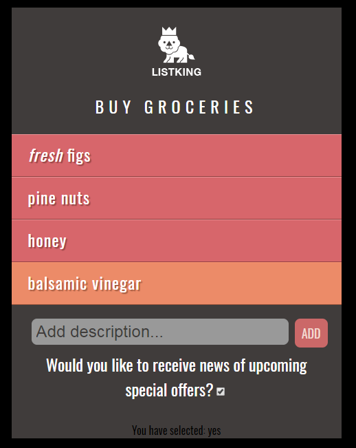

# Exercise 2

- Download, extract and open the [Lab02](archives/lab02.zip) folder.
- In the js/form.js file, carry out the following steps:

  1. Implement the form feature described in the example (step 3 in this section). The new item button should reveal the form field and add button; clicking the add button should add the item to the list.

  2. Edit the script so that the item is added to the start of the list, instead of the end.

  3. Add an event handler to the checkbox. When the checkbox is clicked, it should get the value of the checkbox and display the value in the userSelection div along with a message (e.g. You have selected: yes). It should look as shown here:

