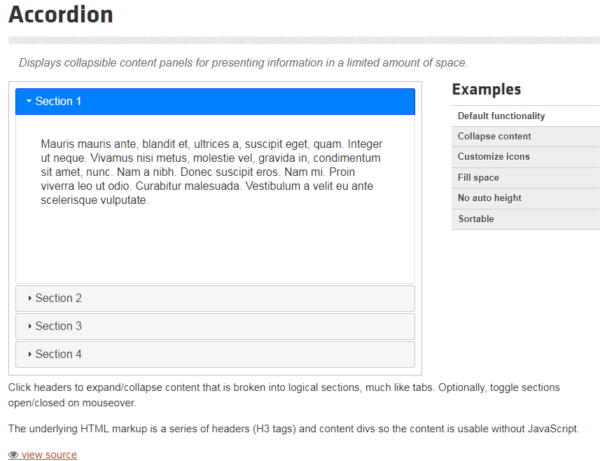
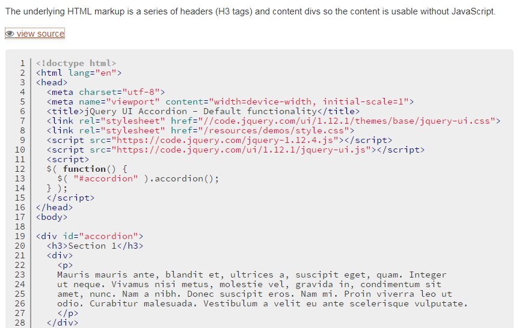

# jQuery UI

jQuery UI is a curated set of user interface interactions, effects, widgets, and themes built on top of the jQuery JavaScript Library. Whether you're building highly interactive web applications or you just need to add a date picker to a form control, jQuery UI is the perfect choice.

There are many options available; we will use the Accordion widget as an example here. The accordion shows and hides paragraphs of text under headings i.e. showing one paragraph at a time.

You can 'view source' on any of the jQuery UI elements to see the code that makes them work. The code for the accordion can be seen here:

