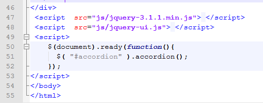

# Steps to add a jQuery UI element to your website

This section will demonstrate how to add the accordion element to a web page.

### Step One: Add jQueryUI CSS links

Links to the jQueryUI CSS should be added to the head section of the page whenever you want to make use of a jQueryUI element on your page:

```html
<link rel = "stylesheet" href="css/jquery-ui.css">
```


### Step Two: Add jQueryUI JavaScript links

You should also include a link to the jQueryUI script at the end of the body section, in addition to the jQuery script.

```html
<script  src="js/jquery-3.1.1.min.js"> </script>
<script  src="js/jquery-ui.js"> </script>
```


### Step Three: add jQuery function

The jQuery shown here targets the #accordion div and calls the accordion() function. Add this after the three lines you added in the previous step.

```js
<script>
$( function() {
  $( "#accordion" ).accordion();
} );
</script>
```




### Step Four: use appropriate HTML

To use the accordion element, add id=accordion to the div containing the `<h3>` headings and paragraphs. The accordion element works with `<h3>` headings and paragraphs - other jQueryUI elements may require different HTML to be used. You can read more about each element on the jQueryUI.com website: <a href="https://jqueryui.com/" target="_ blank">`https://jqueryui.com/`</a>


