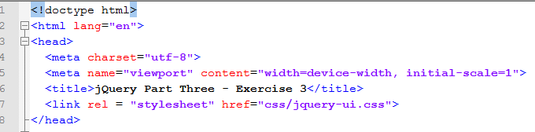

# Steps to add a jQuery UI element to your website

We will demonstrate how the accordion element could be added to our grocery cart example.

### Step One: Add jQueryUI CSS and JS links

Links to the jQueryUI CSS and JavaScript files should be added to the head section of the page whenever you want to make use of a jQueryUI element on your page:

```html
<link rel="stylesheet" href="//code.jquery.com/ui/1.12.1/themes/base/jquery-ui.css">
<script src="https://code.jquery.com/jquery-1.12.4.js"></script>
<script src="https://code.jquery.com/ui/1.12.1/jquery-ui.js"></script>
```



### Step Two: Add jQuery to call the accordion function

The jQuery shown here targets the #accordion div and calls the accordion() function. Add this after the three lines you added in the previous step.

```js
<script>
$( function() {
  $( "#accordion" ).accordion();
} );
</script>
```


