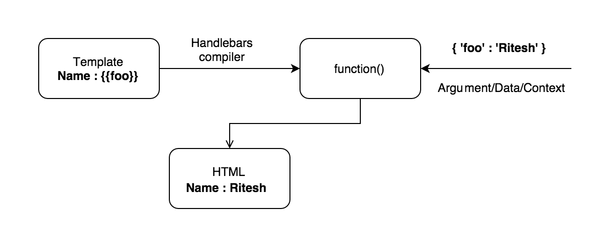

#How Does it Work ?

As shown in the above diagram, the way Handlebars works can be summarised as follows:

1. Handlebars takes a template with the variables and compiles it into a function.
2. This function is then executed by passing a JSON object as an argument. This JSON object is known as context and it contains the values of the variables used in the template.
3. On its execution, the function returns the required HTML after replacing the variables of the template with their corresponding values.