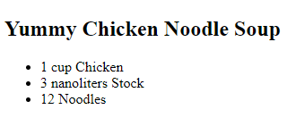

# Helpers Exercises

##Exercise One

- Open the folder called `Week08`.
- Download, extract and open the [Lab02](archives/lab02.zip) folder.
- Open file (exercise1.html).

Given the following data (context):
~~~
var recipe = {
  description: 'Yummy Chicken Noodle Soup',
  ingredients: [
    {quantity: "1 cup", name: 'Chicken'},
    {quantity: "3 nanoliters", name: 'Stock'},
    {quantity: "12", name: 'Noodles'}
  ]
}
~~~

Create and compile a template that will result in the following:

##Exercise Two

- Open file (exercise2.html).

Given the following data (context):
~~~
var data = {
  name: "Jack",
  date: "12/04/12",
  comment: "This is a really <strong>awesome</strong> tutorial. Thanks.",
  social: []
    {
      site: "Twitter",
      name: "Jack_Franklin"
    },
    {
      site: "Github",
      name: "jackfranklin"
    }
  ]
}
~~~

Create and compile a template that will result in the following:

and the following if there are no social sites (i.e. social is an empty array):

